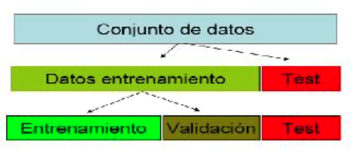
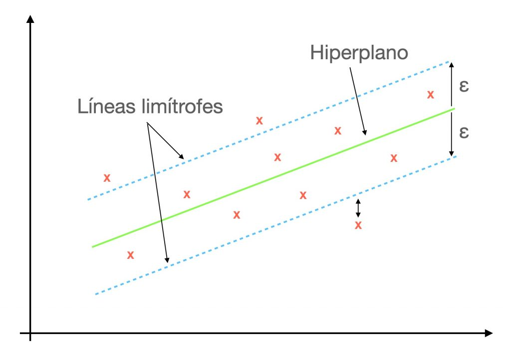
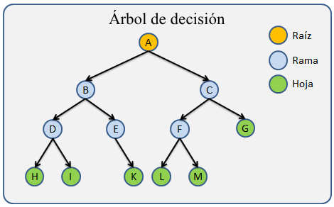
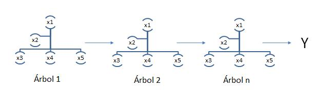

```{r include=FALSE}
knitr::opts_chunk$set(fig.path = 'figurasR/',
                      echo = FALSE, warning = FALSE, message = FALSE,
                      fig.pos="H",fig.align="center",out.width="95%",
                      cache=FALSE)

```

<!-- \setcounter{chapter}{2} -->

<!-- \setcounter{chapter}{2} escribir 2 para capítulo 3  -->

<!-- \pagenumbering{arabic} -->

```{=tex}
\ifdefined\ifprincipal
\else
\setlength{\parindent}{1em}
\pagestyle{fancy}
\setcounter{tocdepth}{4}
\tableofcontents
```
<!-- \nocite{*} -->

\fi

```{=tex}
\ifdefined\ifdoblecara
\fancyhead{}{}
\fancyhead[LE,RO]{\scriptsize\rightmark}
\fancyfoot[LO,RE]{\scriptsize\slshape \leftmark}
\fancyfoot[C]{}
\fancyfoot[LE,RO]{\footnotesize\thepage}
\else
\fancyhead{}{}
\fancyhead[RO]{\scriptsize\rightmark}
\fancyfoot[LO]{\scriptsize\slshape \leftmark}
\fancyfoot[C]{}
\fancyfoot[RO]{\footnotesize\thepage}
\fi
\renewcommand{\headrulewidth}{0.4pt}
\renewcommand{\footrulewidth}{0.4pt}
```

# Proceso de ciencia de datos (Data science process)

## Introducción

La ciencia de datos es la combinación de múltiples campos, como la estadística, la inteligencia artificial (IA), el análisis de datos,... con el objetivo de extraer información de valor de esos datos. La ciencia de datos, abarca las siguientes etapas: recolección de los datos, limpieza, análisis exploratorio, construcción y validación de modelos y predicciones.

Una parte importante de la ciencia de datos es el Aprendizaje Automático o Machine Learning (ML). Se trata de un subcampo dentro de la ciencia de datos, concretamente, una subcategoría de la inteligencia artificial. Está basada en algoritmos, y consiste en que éstos descubran de manera autónoma patrones recurrentes del conjunto de datos. Los algoritmos de ML al detectar patrones en los datos, aprenden y mejoran el rendimiento en la ejecución de una tarea o al hacer predicciones. Una vez entrenado y validado el modelo, el algoritmo podrá encontrar patrones en nuevos datos (predicciones)

Para la correcta explicación de las técnicas que se van a describir, es necesario la definición del aprendizaje estadístico supervisado. 

El aprendizaje estadístico supervisado es una de las principales herramientas del aprendizaje automático y consiste en una serie de técnicas para deducir una función a partir de una serie de datos de entrenamiento. El objetivo es crear o estimar una función capaz de predecir el valor deseado después de haber visto una serie de ejemplos. Para ello, tiene que generalizar a partir de los datos presentados anteriormente a las nuevas situaciones no vistas previamente. La salida de la función puede ser un valor numérico (como en problemas de regresión) o una etiqueta de clase (como en los de clasificación).


## Etapas del proceso de ciencia de datos

A continuación se van a exponer las diferentes etapas que es necesario completar para la correcta realización de un proceso de ciencia de datos (DSP; Data Science Process)


### Conocimiento del negocio (Knowledge of Bussiness)

En esta primera etapa, es fundamental la definición del problema que nos ocupa, la definición de unos objetivos claros y la metodología para cumplirlos.

Esto implica la comprensión de los requisitos del proyecto desde el punto de vista de negocio, utilizando las perspectivas de negocio para determinar a que problemas podemos dar respuesta mediante el uso de la minería de datos.

### Adquisición de los datos (Collect the data)

Explicación de los datos, fuente, explicación de las variables,...

Consiste en explicar como se ha llevado a cabo la adquisición de los datos, la identificación de las distintas fuentes y la explicación de los mismos.

### Preparación de los datos (data preparation)

Raramente encontraremos los datos preparados para su análisis, ya que normalmente es necesario la limpieza y la transformación de los mismos. Para ello, es necesario llevar a cabo un paso previo llamado pre-procesamiento de los datos.

Fases de la preparación de los datos (data cleaning):

-   Eliminación de duplicados (filas y columnas)
-   Datos erróneos (ej: precios negativos)
-   Detección de valores faltantes: decidir si eliminar esos registros o imputarlos
-   Detección de outliers (decidir si mantener, quitar o tratar a parte)
-   Unificación de variables (unificación de unidades,...)
-   Creación de variables a partir de otras ya existentes si fuera necesario

Preparación de los datos

-   Reformateo de variables, por ejemplo, formatos horarios.
-   Categorización,...
-   Selección de variables (Feature selection): elegir las mejores variables que alimenten nuestros algoritmos dictarán la máxima calidad que podemos conseguir, ya que no todas las variables explican el problema que queremos modelar. Podemos resumir esto con la siguiente frase: "Garbage in, garbage out", es decir, si entra basura saldrá basura. Refiriendonos con basura a ruido en los datos o información pobre.

### Análisis exploratorio de datos (EDA)

El análisis exploratorio se utiliza para ver lo que nos pueden ofrecer los datos antes de la etapa del modelado y se lleva a cabo para resumir las principales características del conjunto de datos a través de diferentes tareas:

-   Estudio descriptivo de los datos: La estadística descriptiva es la parte de la estadística dedicada a la ordenación y tratamiento de la información por medio de gráficas y tablas, además de la obtención de parámetros útiles para explicar la información

-   Visualizaciones de los datos:

    -   Análisis univariante: Empleado para observar diferentes características de interés, tratar de identificar patrones en los datos o ver la distribución de las variables . Algunos ejemplos serían los gráficos de caja y bigote o histogramas
    -   Análisis multivariante: Donde tratamos de ver la asociación o relación que pueden tener las distintas variables de interés. Encontramos los gráficos de barras o gráficos de dispersión entre los ejemplos de representaciones multivariantes.

-   Relación entre las variables

Este tipo de análisis permite obtener medidas descriptivas de un conjunto de datos para poder extraer conclusiones referentes a una muestra o población.

### Modelado

En la etapa de modelado aplicaremos algoritmos de aprendizaje automático. Para llevar a cabo esta fase y con el objetivo de obtener mayor robustez en los modelos, aplicaremos la técnica conocida como *hold out*.

El *hold out* es una técnica en la que dividimos los datos en dos partes mutuamente excluyentes (no superpuestas), utilizando una de ellas para el entrenamiento de los modelos y la otra para el testeo.

La traducción literal para hold-out es *retención* y esta técnica recibe este nombre porque reservamos una parte de los datos para probar el modelo en datos nuevos.

Esta técnica se emplea para evitar el sobreajuste. Este aparece cuando un modelo que se adapta perfectamente a los datos de entrenamiento obteniendo unas métricas muy buenas pero que luego es incapaz de generalizar con datos nuevos, y por tanto, existe una sobrevaloración de la capacidad predictiva de los modelos obtenidos.


Por tanto, dividimos los datos en el conjunto de datos de entrenamiento, validación y testeo. Para ello, generamos un conjunto de entrenamiento y otro de testeo a partir del conjunto de datos muestral. A continuación, volvemos a dividir los datos de entrenamiento en datos de entrenamiento y validación, obteniendo así tres conjuntos de datos: entrenamiento, validación y testeo. 



El conjunto de *datos de entrenamiento* es aquel que utilizamos para probar diferentes hiperparametrizaciones de cada modelo para ver cual es la más óptima. La hiperparametrización variará en función de los parámetros aplicables a cada algoritmo utilizado.

Una vez hayamos entrenado los modelos, pasamos a la fase de validación, donde aplicaremos a los *datos de validación* los diferentes algoritmos con la configuración de parámetros que mejor haya funcionado en el conjunto de datos de entrenamiento.

El modelo con el que obtengamos las mejores métricas será el que posteriormente apliquemos a los *datos de testeo*, ofreciéndonos el error real cometido con el modelo seleccionado. Es decir, este último conjunto de datos se utiliza para estiamr el error de generalización del modelo, ya que nuestro objetivo es obtener un error de generalización pequeño evitando el sobreajuste.

A continuación vamos a exponer tres algoritmos de aprendizaje automático que posteriormente aplicaremos a nuestros datos de ventas de productos.

#### Máquinas de vector soporte (Support Vector Machines SVMs)

Las máquinas de vector soporte son un conjunto de algoritmos de aprendizaje estadístico supervisado pertenecientes a la familia de los clasificadores lineales.
Este algoritmo, más conocido como SVM fue desarrollado en los laboratorios AT&T Bell por Vapnik y otros autores a mediados del 1960, inicialmente para problemas de clasificación binaria, basados en la idea de separar los datos mediante hiperplanos. Actualmente existen extensiones dentro de esta metodología pra clasificación con más de dos categorías, para regresión y también para la detección de datos atípicos. La idea fundamental es la utilización de vectores que hacen de soporte con el fin de maximizar la separación entre los datos y el hiperplano.


Suponiendo que tenemos ejemplos de sólo dos categorías y sin pérdida de generalidad, una SVM construye un hiperplano en un espacio de dimensionalidad muy alta. Este hiperplano separa de forma óptima los puntos de una clase de la otra. La característica fundamental de estos algoritmos es el concepto de "separación óptima", ya que se busca el hiperplano que tenga la máxima distancia con los puntos que estén más cerca de él mismo al tiempo que clasifica correctamente tantos puntos de entrenamiento como sea posible. Los algoritmos SVM representan el hiperplano óptimo con vectores de soporte.

En nuestro caso al ser la variable volumen de ventas una variable numérica, vamos a centrarnos en la variante SVM para regresión, tambien conocida como SVR (support vector regressor). El caso del problema de regresión es una generalización del problema de clasificación, en la que el modelo devuelve un valor continuo, es decir, un modelo de regresión estima una función multivariante de valor continuo.

##### Descripción del algoritmo

Dado un conjunto de ejemplos de entrenamiento $S = \big\{(x_1,y_1), \dots,(x_n,y_n)\big\}$, donde $x_i \in \mathbb R^d \text{ e }\ y_i \in \mathbb R$, en el que se asume que todos los valores $y_i$ de todos los ejemplos de $S$ pueden ser ajustados mediante un hiperplano, nuestro objetivo será encontrar los parámetros $w = (w_1,\dots,w_d)$ que permitan definir el hiperplano de regresión \[y=f(x) = (w_1x_1+\dots+w_dx_d) + b = \langle w,x \rangle+b \text{ , } b \in \mathbb R\]

La generalización de SVM a SVR se logra introduciendo una región insensible a $\epsilon$ alrededor de la función. Esta región se conoce como tubo épsilon. Este tubo reformula el problema de optimización para encontrar el tubo que mejor se aproxime a la función al tiempo que equilibra el error de predicción, es decir, se formula un problema de optimización definiendo una función de pérdida a minimizar insensible a $\epsilon$ y encontrando el tubo más plano que contiene a la mayoría de instancias de entrenamiento.

Se dice **rudio, perturbación aleatoria o tubo épsilon** y se representa por $\epsilon \sim N(0,\sigma^2)$, al error en la medición del valor $y$, por tanto, $y=f(x) + \epsilon$

El valor de $\epsilon$ determina el ancho del tubo, y un valor más pequeño indica menor tolerancia al error, cuando más pequeño sea el valor de $\epsilon$, el límite del tubo se desplaza hacia dentro, habiendo más puntos de datos alrededor del límite, lo que indica más vectores de soporte.

Se define la **función de pérdida lineal** $\epsilon-$ insensible, y se representa como $L_{\epsilon}$ a una función lineal en el que la función de pérdida toma valor nulo y viene definida de la siguiente forma: \[L_{\epsilon} = 
\begin{cases} 
0 & \text{ si} |y-f(x)| \leq \epsilon, \\ 
|y-f(x)| - \epsilon & \text{ en caso contrario }
\end{cases}\]

Por tanto, el problema fué planteado por Vapnik como el siguiente probema de optimización:

\[
Min_{w,b} \frac{1}{2} ||w||^2 + C \sum_{i=1}^n (\xi_i + \xi_i^*)
\]

\[s.a = 
\begin{cases}
y_i - w \cdot x_i -b & \leq \epsilon, +\xi_i  \\ 
w \cdot x_i + b - y_i & \leq \epsilon + \xi_i^*
\\
\xi_i , \xi_i^* & \geq 0 \forall i
\end{cases}\]

Cuando el error es menor que $\epsilon$, las variables de holgura valen 0. Para resolverlo, podemos recurrir al problema dural y al uso de funciones base para trabajar en espacios de mayor dimensión.


```{r SVR_lu, echo=FALSE,  fig.align='center', fig.pos='H',fig.cap='Vectores de Soporte de Regresión.'}

```


#### K-Nearest Neighbor Regression (KNN)

El algoritmo de K-vecinos más cercanos, más conocido como KNN, fué desarrollado en el año 1951 por los matemáticos Evelyn Fix y Andrew Hodges.

El algoritmo KNN es un método de aprendizaje supervisado que está basado en criterios de vecindad, por lo que es necesario establecer cierta medida de distancia entre los diferentes elementos de la representación. La ventaja de la aplicación de técnicas basadas en la vecindad es la siguiente: el valor de salida que se otorgará a una nueva instancia se calculará en función de los valores de los puntos más cercanos a ella. Se trata de un método local, que asume que la salida de un nuevo dato depende exclusivamente de los k vecinos de entrenamiento más próximos.


##### Descripción del algoritmo

Este algoritmo puede ser utilizado para modelos de clasificación y de regresión, ocupándonos en este trabajo la segunda opción. En el caso de la clasificación, se determinará la clase a la que pertenecerá la nueva instancia en función de la clase mayoritaria de los vecinos más cercanos del conjunto de entrenamiento; y en regresión, el modelo debe determinar el valor del nuevo dato como el valor medio de los k ejemplos de entrenamiento más cercanos, siguiendo la siguiente ecuación del valor de la nueva instancia de entrada:

\[
Valor(Inst_{\text{entrada}}) = \dfrac{1}{K} \sum_{i=1}^k Valor(P_i)
\]

Como ya habíamos avanzado antes, para determinar como de cercanos se encuentran unas instancias de otras, es necesario definir una medida de similitud o distancia para todos los datos del conjunto muestral. Definiremos esta medida de similitud a través de una función, como puede ser la distancia Manhattan, la distancia Minkow o las más utilizada, la distancia Euclídea, que es la que se va a utilizar, y viene dada por:

\[
d(p,1) = \sqrt{ \sum_{i=1}^n (p_i-q_i)^2}
\]


Una vez definida esta medida, procedemos a la descripción del algoritmo:

- Se almacena el conjunto de datos de entrenamiento compuesto por un vector de entrada y otro de salida
- Se establece el valor del parámetro k
- Se presenta una nueva instancia j teniendo en cuenta únicamente el vector de entrada de esta nueva instancia

  - Se calcula la distancia euclídea de la nueva instancia con todos lso datos del conjunto de entrenamiento
  - Se calcula la salida del este nuevo dato como la media de las salidas de los k datos más cercanos a él

- Se repite el paso anterior para todas las instancias del conjunto de datos

```{r knn_esq, echo=FALSE,  fig.align='center', fig.pos='H',fig.cap='Esquema conceptual del algoritmo KNN de regresión.'}

knitr::include_graphics("graficos/knn_regression.png")
```


En la figura  [4.3](#knn_esq) podemos ver un esquema conceptual del algoritmo, donde el valor de salida que el modelo le dará al nuevo punto marcado con una *x* será la media de los valores de los puntos vecinos. Habiéndose seleccionado a modo de ejemplo el valor de k=3 y k=5.


##### Elección del parámetro k

Es necesario seleccionar el valor que se le va a dar al parámetro k, es decir, el número de vecinos con los que se realizará la media para obtener el valor de salida de la nueva instancia.
Si este valor es muy grande, la idea de vecinos que están lejos podrían influir con la nueva instancia sin tener relación, pero si este valor es demasiado pequeño, el algoritmo será muy sensible a valores extremos. 

#### Árboles de decisión (XGBoost Model)


Los árboles de regresión conducen a dividir o segmentar el espacio predictor en regiones más simples de tal forma que la predicción de una instancia se hará a través de la media (o moda) de la región a la que pertenece.

En el caso de los árboles de decisión, el conjunto de reglas empleadas para la segmencación del espacio de predicción se puede resumir en un árbol.

El análisis de árboles de clasificación y regresión, generalmente consiste en tres fases:

* **Construcción del árbol máximo**: este árbol se cosntruye empleando un procedimiento de partición binaria, comenzando en la raíz del árbol. Este primer árbol describe el conjunto de entrenamiento y contiene gran cantidad de niveles (sobreajuste) y nodos, pudiendo ser demasiado complejo. Cada grupo es categorizado por la media (regresión) o la distribución (clasificación) de la variable respuesta, el tamaño del nodo y los valores de las variables explicativas que lo definen.




En la figura anterior, podemos ver la representación de un árbol de decisión desde el nodo raíz. Entre sus componentes encontramos: *las ramas*, que son los segmentos del árbol que conectan los nodos; *los nodos internos*, puntos a lo largo del árbol donde se va dividiendo el espacio predictor y *los hojas* (nodos terminales).


* **Poda del árbol**: El árbol máximo está generalmente sobreajustado y por tanto, un árbol más pequeño con menos divisiones podría conducir a una menor varianza. Por este motivo, procede a la poda de éste cortando ramas hasta encontrar el tamaño "adecuado" del árbol. 

Una forma de resolver el problema es generar una serie de árboles anidados (árboles de secuencia anidada) de tamaños decrecientes, seleccionando para cada tamaño el mejor de todos. Posteriormente, se comparan para determinar el óptimo mediante el criterio de coste-complejidad. 

Para cada árbol *T*, se define la función de costo-complejidad, y se representa como $R_{\alpha}(T)$, como: $R_{\alpha}(T) = R(T) + \alpha | \widetilde{T}|$, 

donde

- R(T) indica el promedio de la suma de cuadrados entre los nodos
- $| \widetilde{T}|$ indica la complejidad del árbol, que se define como el número total de nodos terminales
- $\alpha$ es el parámetro de complejidad, valores altos de este parámetro indican árboles pequeños


* **Selección del árbol óptimo mediante validación cruzada**: El objetivo es seleccionar uno de los árboles de todos los árboles podados como el árbol óptimo, que será el árbol solución. El método de selección consistirá en asociar una medida de error a cada árbol y elegir el que tenga asociado un menor error. 

El parámetro de complejidad definido es el que controla la compensación entre la complejidad (tamaño) del árbol y el ajuste a los datos de entrenamiento. Cuando $\alpha=0$, el subarbol *T* es el árbol máximo. Sin embargo, a medida que aumenta $\alpha$, las ramas del árbol se podan de forma anidada, siendo sencillo conseguir una secuencia completa de subárboles en función del valor del parámetro de complejidad. Podemos seleccionar un valor de $\alpha$ a través de un conjunto de validación cruzada.


Para la descripción del algoritmo *Extreme Gradient Boosting*, también conocido como XGBoost, es necesario la definición de varios conceptos, los *bosques aleatorios* y el método de aprendizaje estadístico *Boosting*.

Los bosques aleatorios (*Random Forest*) son una extensión de los árboles de clasificación. El modelo Random Forest es una técnica utilizada tanto para clasificación como para regresión basada en un conjunto de árboles de decisión. Este método selecciona submuestras del conjunto de datos inicial, asegurando así el uso de todas las variables y datos para construir el modelo, haciéndolo además idóneo para trabajar con grandes conjuntos de datos.

El método *boosting* tiene como propósito la reducción del sesgo. Se trata de un proceso iterativo que en lugar de ajustar un árbol de decisión, aplica la técnicas repetidas veces de forma secuencial, y por tanto, el algoritmo va aprendiendo lentamente. Este método no se aplica sobre los datos, sino sobre los resíduos. 

Dado un árbol que ha sido previamente ajustado, se aplica un nuevo árbol para los resíduos del modelo, permitiendo así el reajuste del modelo. Este nuevo árbol de decisión construido con los resíduos se añade dentro de la función ajustada con el fin de mejorar el algoritmo en cada iteracción y no de forma global.

Para aplicar esta técnica, es necesario fijar una serie de parámetros:

- Tamaño del árbol **d**, es decir, el número de nodos terminales
- El número de árboles **B**. Nota: un valor muy alto podría llevar a sobreajuste
- El parámetro de regularización $\lambda$, que puede ser interpretado como una proporción de aprendizaje, es decir, la velocidad a la que aprende el algoritmo. Se trata de un parámetro acotado entre 0 y 1, siendo habitual elegir $\lambda = 0.01$ o $\lambda = 0.001$.

Este tipo de técnicas es aplicable tanto a problemas de regresión como de clasificación, sin embargo, nosotros nos centraremos en las de regresión, especialmente en el modelo *Extreme Gradient Boosting Algorithm*, tambien conocido como XGBoost. 

Este algoritmo se encuentra dentro del marco de algoritmos de aprendizaje supervisado, y fué propuesto en el año 2016 por Chen y Guestrin y presenta las siguientes características:

- Consiste en la agregación de árboles de manera secuencial con el objetivo de aprender el resultado de los árboles previos y corregir el error producido por éstos, hasta que no se pueda reducir más el error (gradiente descendente)

- Para evitar el sobreajuste, realia un procesamiento en paralelo, la poda de árboles, el control de los valores perdidos y la optimización que penaliza la complejidad de los modelos.



##### Descripción del algoritmo

EL funcionamiento del algoritmo se puede resumir en cuatro pasos:

Dada una miestra inicial de aprendizaje $\{(x_i,y_i): i=1,\dots,n\}$.

- En primer lugar, se obtiene un árbol inicial con *d* divisiones, $T_o$ para predecir la variable respuesta $Y$, asociando el resultado a un valor residual $r_i$
- Se obtiene un nuevo árbol *R* que se ajusta al error del paso anterior
- Los resultados de los árboles $T_o$ y *R* se combinan para obtener un árbol $T_1$, donde el error cuadrático medio será menor que el del árbol inicial
- Se continúa el proceso de forma iterativa hasta que el error es minimizado lo máximo posible


#### Evaluación y presentación de resultados (+análisis del error)

-   Predicciones con el mejor modelo
-   Final de la historia de una forma ordenada y resumida
-   Señalar posibles mejoras y recomendaciones para proyectos futuros
